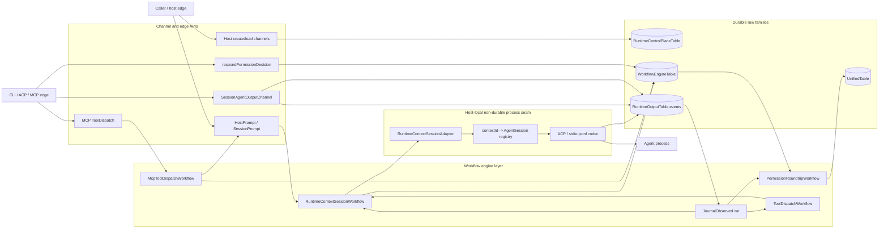
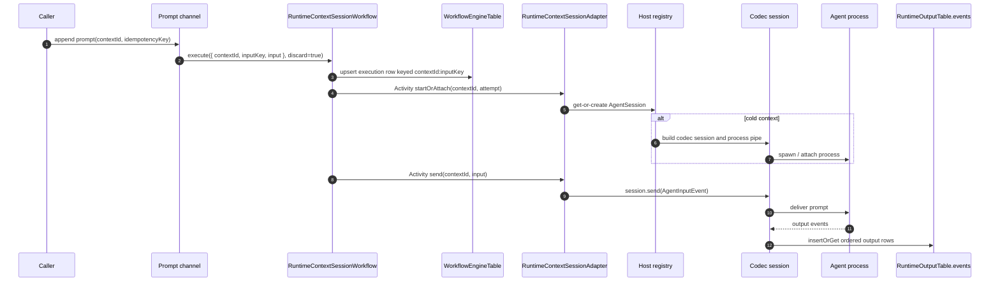
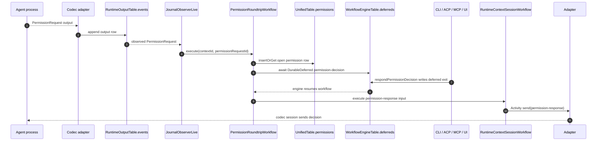
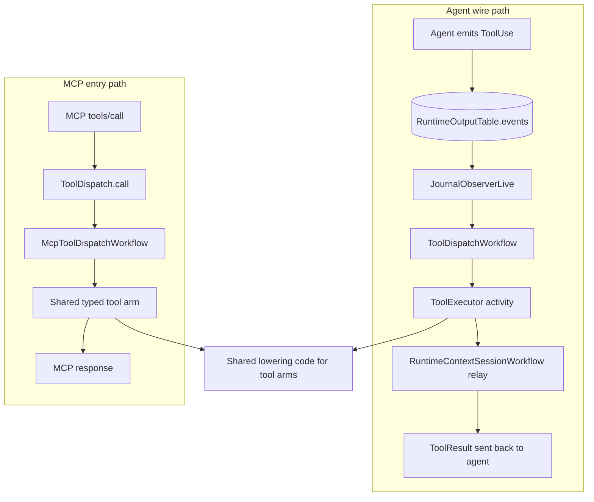
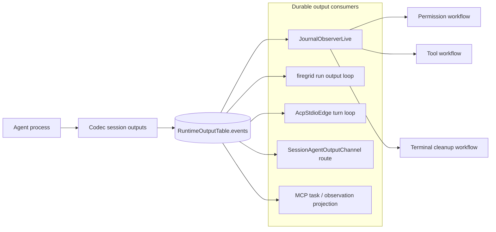
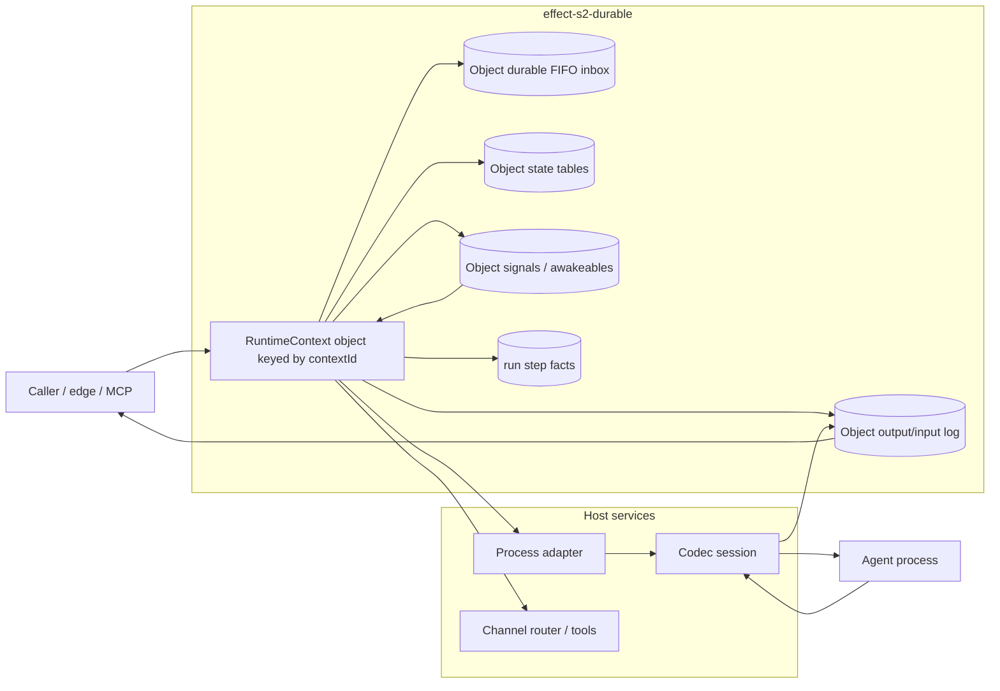

# Runtime Durable Seams Analysis

Date: 2026-06-16  
Scope: `packages/runtime/src/**`  
Target package considered: `gurdasnijor/fluent-firegrid/packages/effect-s2-durable` on GitHub and the local checkout at `/Users/gnijor/gurdasnijor/fluent-firegrid/packages/effect-s2-durable`.

## Executive Summary

`packages/runtime` currently uses the workflow engine as both:

1. a low-level durable execution substrate over Durable Streams rows; and
2. an application choreography mechanism for prompts, session input, tool calls, permissions, schedules, peer events, MCP entry calls, and output observation.

The important durable seams are not just the 13 files importing `WorkflowEngine`. The real seams are the persisted row families and the communication paths that cross them:

- `WorkflowEngineTable`: execution lifecycle, activity memoization, activity claims, deferred completions, and clock wakeups.
- `RuntimeControlPlaneTable`: durable context/session creation and context resolution.
- `RuntimeOutputTable`: ordered agent output journal and observer source.
- `UnifiedTable`: UI-readable permission/schedule/peer-event facts whose lifecycle is partly delegated to workflow completion state.
- Channel bindings: public prompt/session APIs that lower into `RuntimeContextSessionWorkflow.execute({ discard: true })`.
- Observer daemon: output-journal rows become sibling workflow executions.
- Adapter registry: workflow activities cross from durable code into a host-local long-lived process/session registry.

The package `effect-s2-durable` already matches a lot of the intended direction: a Restate-shaped authoring surface, durable `run`, `sleep`, `state`, `signal`/`awakeable`/`deferred`, recovery registry, attach/poll, and keyed virtual objects. To replace or simplify this runtime, the missing pieces are not a larger workflow-engine clone. They are:

- service/object handler registration with Layer-provided host dependencies that also work during recovery;
- a first-class durable event/log observation primitive with cursor + match + timeout semantics;
- external signal resolution that can safely target recovered or remote-owned executions;
- cross-worker side-effect fencing or a clear single-owner host admission contract;
- cancel/interrupt/terminal lifecycle APIs;
- a clean output-log/inbox model so session input, tool results, permission decisions, and terminal events become one owner workflow/object state machine instead of many operation-shaped workflows.

## Source Baseline

Local source read:

- `packages/runtime/src/engine/internal/{table,engine-runtime}.ts`
- `packages/runtime/src/engine/durable-streams-workflow-engine.ts`
- `packages/runtime/src/unified/{host,channel-bindings,observers,tables,adapter,codec-adapter}.ts`
- `packages/runtime/src/unified/subscribers/{runtime-context,permission-and-tool,scheduled-webhook-peer}.ts`
- `packages/runtime/src/unified/mcp-host/{tool-dispatch,mcp-host,task-projection}.ts`
- `packages/runtime/src/channels/{host-control,router,session-agent-output-route}.ts`
- `packages/runtime/src/bin/run.ts`
- `features/firegrid/{workflow-engine-durable-state,firegrid-workflow-driven-runtime,firegrid-durable-tools}.feature.yaml`

External target checked:

- GitHub: <https://github.com/gurdasnijor/fluent-firegrid/tree/main/packages/effect-s2-durable>
- Local implementation: `/Users/gnijor/gurdasnijor/fluent-firegrid/packages/effect-s2-durable`

## Durable Store Inventory

| Store | Runtime owner | Durable role | Main consumers |
|---|---|---|---|
| `WorkflowEngineTable.executions` | `engine/internal/table.ts` | Execution row, payload, suspension/final result, interrupt flag, trace parent. | Engine `execute`, `resume`, `poll`, deferred/clock recovery. |
| `WorkflowEngineTable.activities` | `engine/internal/table.ts` | Durable activity result memoization keyed by execution/activity/attempt. | `Activity.make` via `activityExecute`. |
| `WorkflowEngineTable.activityClaims` | `engine/internal/table.ts` | Side-effect fence for concurrent workers racing an activity attempt. | `claimActivity` in `engine-runtime.ts`. |
| `WorkflowEngineTable.deferreds` | `engine/internal/table.ts` | Durable `DurableDeferred` exit row; truth for signal completion. | Permission decisions, peer events, engine deferred recovery. |
| `WorkflowEngineTable.clockWakeups` | `engine/internal/table.ts` | Durable clock wakeup row for `DurableClock.sleep`. | Scheduled prompt and any workflow clock use. |
| `RuntimeControlPlaneTable.contexts/runs` | protocol table, used in runtime | Durable context/session facts and lifecycle stream. | Host create/load channels, context resolver, session lifecycle channel. |
| `RuntimeOutputTable.events` | protocol table, used in runtime | Ordered durable output journal from codec sessions. | Journal observer, session output channel, CLI/ACP turn readers, MCP projection. |
| `UnifiedTable.permissions` | `unified/tables.ts` | UI-renderable open permission request fact. Decision is not stored here. | Permission workflow and host/UI readers. |
| `UnifiedTable.schedules` | `unified/tables.ts` | UI-renderable schedule commitment. Firing is inferred from workflow result/clock. | Scheduled prompt workflow. |
| `UnifiedTable.peerEvents` | `unified/tables.ts` | External peer event payload. | Peer event observer workflow. |

The notable pattern is that the engine table stores lifecycle and completion evidence. `UnifiedTable` deliberately avoids duplicating workflow lifecycle status for permissions and schedules.

## Workflow Engine Substrate

`DurableStreamsWorkflowEngine.layer(...)` installs two services: `WorkflowEngine.WorkflowEngine` and `WorkflowEngineTable`. It is composed into the runtime floor from the `DurableStreams` backend using the `StreamName.Engine` stream.

The engine implementation in `engine-runtime.ts` provides these durable semantics:

- `register`: process-local workflow definitions are registered before persisted executions can resume. Registration also triggers kind-aware recovery of already-completed deferred waits for that workflow name.
- `execute`: creates or reuses an execution row, stamps row OTel parent context, resumes the execution, and optionally joins it for `discard` calls.
- `resume`: reconstructs `WorkflowInstance`, re-runs the body under the workflow engine and instance services, then upserts suspension or final-result evidence.
- `activityExecute`: reads prior activity result, claims the activity attempt with `insertOrGet`, suspends if another worker owns the claim, executes the activity, and persists the non-suspended result.
- `deferredResult` / `deferredDone`: read/write deferred exit rows and resume the owning execution.
- `scheduleClock`: persists a clock wakeup row, schedules an in-process delayed fiber, marks fired, and completes the clock deferred.
- startup/recovery: pending clock wakeups are re-armed at engine construction; non-clock deferred waits are recovered at workflow registration.

This is the runtime's current "durable kernel." It is generic enough for `@effect/workflow`, but Firegrid code often leaks its details by calling workflow `.execute`, `DurableDeferred.succeed`, or `WorkflowEngine` directly from channel/edge code.

## Workflow Inventory

| Workflow | Trigger | Durable identity | What it does | Communication edges | Status / concern |
|---|---|---|---|---|---|
| `unified.runtime-context-session` | Prompt channel, terminal signal, observer terminal, sibling relay. | `contextId:inputKey`. | Per input: activity `startOrAttach`, optional `send`, terminal `deregister`, return. | Channels -> workflow -> adapter registry -> codec process; sibling workflows relay into it. | Central live session seam. Per-event workflow shape is simpler than old parked body but still creates one execution per input. |
| `unified.permission-roundtrip` | Journal observer sees `PermissionRequest`. | `contextId:permissionRequestId`. | Record `permissions` row, await decision deferred, relay `PermissionResponse` input. | Output journal -> observer -> workflow -> `UnifiedTable.permissions`; edge/CLI/MCP -> `respondPermissionDecision` -> deferred -> session input. | Good illustration of durable awaitable plus UI fact. |
| `unified.tool-dispatch` | Journal observer sees host-dispatched `ToolUse`. | `toolUseId`. | Execute tool once in an activity, encode result, relay `ToolResult` input. | Output journal -> observer -> workflow -> executor -> session input. | Operation-shaped workflow; current specs call this class migration debt unless owned by a durable resource/state machine. |
| `unified.scheduled-prompt` | Registered layer; no production `.execute` caller found in current source. | `contextId:scheduleId`. | Insert schedule row, `DurableClock.sleep`, return fired time. | Intended schedule request -> workflow clock -> result. | Dark/unreached in current source. Also does not relay a scheduled prompt back to session. Existing analysis docs flag this. |
| `unified.peer-event-observer` | Registered layer; no production arm found in current source. | `observerId`. | Await peer-event deferred, read `peerEvents` row, return it. | Intended peer event writer -> deferred -> observer workflow. | Dark/unreached in current source; `emitPeerEvent` is described in comments/SDDs but not present here. |
| `unified.mcp-tool-dispatch` | MCP `tools/call` through `ToolDispatchLive`. | `toolUseId`. | Execute typed tool arm once in an activity, return result directly to MCP caller. | MCP handler -> workflow -> typed tool executor -> MCP response. | Relay-free Shape D. Some wait/sleep arms are intentionally process-local because MCP call is synchronous and connection-owned. |

The current runtime composition registers five unified subscriber workflows plus the MCP tool workflow when `ToolDispatchLive` is installed.

## Visual Data-Flow Maps

### Current Runtime, Durable Seams



Read this as "durable truth flows through the table nodes." The adapter registry is intentionally not durable; it is reconstructed or cleaned up by workflow activity calls and terminal observations.

### Prompt to Live Agent Session



The replay fences are the workflow execution id (`contextId:inputKey`) and the activity names inside that execution. The adapter registry prevents multiple live processes for one `contextId` while the host process is up.

### Permission Roundtrip



`UnifiedTable.permissions` is for rendering the pending request. The decision's durable truth is the workflow-engine deferred row.

### Tool Call Paths



The wire path is relay-oriented because the agent is waiting inside its own session turn. The MCP path is response-oriented because `tools/call` already has a synchronous response channel.

### Output Observation Fan-Out



This is the highest-leverage shared seam: once output rows are durable and sequenced, UI/CLI/ACP/MCP consumers and workflow observers can all use the same source of truth.

### Target Shape With `effect-s2-durable`



The simplification goal is to make one durable owner per `contextId` hold the inbox, process state, output log, permission/tool waits, and terminal lifecycle. That collapses today's observer-plus-sibling-workflow fan-out into methods and durable state owned by the runtime-context object.

## Communication Channels Between Components

### 1. Host Control Channels

`HostContextsCreateChannel` and `HostSessionsCreateOrLoadChannel` are callable channels over `RuntimeControlPlaneTable`. They insert-or-get context rows and return `{ sessionId, contextId }`. They do not invoke the workflow engine directly.

`SessionLifecycleChannel` is an ingress channel over `RuntimeControlPlaneTable.runs`, exposing a per-session lifecycle stream.

These channels are durable because their authority is the control-plane table.

### 2. Prompt / Session Input Channels

`HostPromptChannelSignalingLive` and `SessionPromptChannelSignalingLive` are public channel bindings that encode prompt payloads into `SessionInputPayload` and lower them to:

```ts
RuntimeContextSessionWorkflow.execute(..., { discard: true })
```

The communication path is:

```
caller -> HostPromptChannel/SessionPromptChannel
       -> RuntimeContextSessionWorkflow execution row
       -> Activity startOrAttach/send
       -> RuntimeContextSessionAdapter
       -> codec process/session.send
```

Terminal cancel/close no longer have separate channel Tags. Callers use `emitSessionTerminalSignal`, which also executes `RuntimeContextSessionWorkflow` with a terminal input.

### 3. Permission Decision Channel

Permission responses are direct durable operations, not a Tag:

```
edge/CLI/MCP -> respondPermissionDecision(engine, request)
             -> PermissionRoundtripWorkflow.executionId(payload)
             -> DurableDeferred.tokenFromExecutionId(...)
             -> DurableDeferred.succeed(...)
             -> WorkflowEngine.deferredDone row
             -> permission workflow resumes
             -> relays PermissionResponse to RuntimeContextSessionWorkflow
```

This is an important seam for `effect-s2-durable`: the external resolver needs a stable execution id and deferred/signal name, and it must be safe across restart.

### 4. Output Journal Observation

`ProductionCodecAdapterLive` drains codec `AgentOutputEvent` streams into `RuntimeOutputTable.events`. `RuntimeAgentOutputEventsLayer` projects those rows into typed `RuntimeAgentOutputObservation`s.

`JournalObserverLive` consumes that stream and triggers workflows:

- `PermissionRequest` -> `PermissionRoundtripWorkflow.execute`.
- `ToolUse` with `providerExecuted !== true` -> `ToolDispatchWorkflow.execute`.
- `Terminated` -> terminal `RuntimeContextSessionWorkflow.execute({ discard: true })`.

This path is intentionally idempotent at the workflow level, so the observer can be naive about duplicate row observations.

### 5. Runtime Channel Router

`RuntimeChannelRouter` is a host-local route catalog over existing channel values. It supports:

- `send` on egress/bidirectional channels;
- `call` on callable channels;
- `wait_for` on ingress/bidirectional streams by taking the next matching row.

The MCP tool arms `send`, `call`, `wait_for`, and `wait_any` use this router. This router is not itself durable; durability comes from the underlying channel/table stream or from the caller's owning workflow.

Current `McpToolDispatchWorkflow` wraps router use in an `Activity.make`, which memoizes the tool arm result per `toolUseId`, but the wait itself uses stream subscription and `Clock.sleep` inside the MCP request path rather than `DurableClock.sleep`.

### 6. Adapter Registry and Process Boundary

`RuntimeContextSessionWorkflow` crosses into `RuntimeContextSessionAdapter` via activities:

- `startOrAttach(contextId, attempt)`
- `send(contextId, attempt, input)`
- `deregister(contextId)`

`ProductionCodecAdapterLive` owns an in-memory `contextId -> AgentSession` registry, protected by a semaphore to avoid duplicate process spawn under concurrent per-input workflows. It resolves context rows, creates a sandbox process, builds the codec session, and drains outputs into the durable output journal.

This is the main non-durable seam. Correctness relies on:

- workflow activity memoization per input;
- adapter singleton per `contextId`;
- durable output journaling once the process is live;
- terminal events eventually calling `deregister`.

An `effect-s2-durable` replacement should model this as a keyed object or owned process state machine, not as unrelated one-shot service calls.

### 7. MCP Host Communication

`FiregridMcpServerLayer` exposes the Firegrid toolkit through `@effect/ai` MCP server layers. It has two transport shapes:

- local HTTP route `/runtime-context/:contextId`;
- durable-streams-backed protocol projection.

Tool calls resolve runtime context, then use `ToolDispatch.call(...)`. In the HTTP case, result delivery is synchronous in the MCP response. In the durable-streams protocol case, the projection runtime also needs permission decisions and output/task projection over durable rows.

## End-to-End Durable Flow Sketches

### Prompt to Agent

```
HostPromptChannel.append / SessionPromptChannel.forSession(...).append
  -> encode AgentInputEvent as SessionInputPayload
  -> RuntimeContextSessionWorkflow.execute({ discard: true })
  -> executions row keyed contextId:inputKey
  -> Activity startOrAttach
  -> Activity send
  -> adapter session.send
  -> agent process
```

### Agent Permission Request

```
agent process output
  -> codec AgentOutputEvent
  -> RuntimeOutputTable.events
  -> RuntimeAgentOutputEvents projection
  -> JournalObserverLive
  -> PermissionRoundtripWorkflow.execute
  -> UnifiedTable.permissions insertOrGet
  -> DurableDeferred.await("permission-decision")

edge/CLI/UI decision
  -> respondPermissionDecision
  -> DurableDeferred.succeed(token)
  -> engine deferreds row
  -> permission workflow resumes
  -> relay PermissionResponse through RuntimeContextSessionWorkflow
  -> adapter session.send
```

### Agent Tool Call, Wire Path

```
agent ToolUse output
  -> RuntimeOutputTable.events
  -> JournalObserverLive
  -> ToolDispatchWorkflow.execute keyed by toolUseId
  -> Activity unified.tool.execute/toolUseId
  -> ToolExecutor
  -> relay ToolResult through RuntimeContextSessionWorkflow
  -> adapter session.send
```

### MCP Tool Call

```
MCP tools/call
  -> FiregridAgentToolkit handler
  -> ToolDispatch.call
  -> McpToolDispatchWorkflow.execute keyed by toolUseId
  -> Activity unified.mcp-tool.execute/toolUseId
  -> shared typed tool arm
  -> direct MCP response
```

### Agent Output Observation

```
adapter session.outputs
  -> RuntimeOutputTable.events insertOrGet
  -> SessionAgentOutputChannel.forContext(contextId).binding.stream
  -> ACP stdio edge / CLI / runtime channel route / MCP projection
```

The output stream is a durable communication channel because consumers observe table rows with sequence cursors. It is not mediated by the workflow engine except where `JournalObserverLive` uses those rows to start sibling workflows.

## Current Design Debt Relevant to Simplification

1. **Operation-shaped workflows are already marked as debt.** `firegrid-workflow-driven-runtime.WORKFLOW_ADMISSION` says new production `Workflow.make` definitions should be reserved for owned durable resources or long-running process state machines; one-shot commands, waits, and routing bridges are insufficient identities.

2. **`ScheduledPromptWorkflow` and `PeerEventObserverWorkflow` are registered but appear unreachable in current production source.** A direct search found no production `.execute` arm for either. Existing analysis under `docs/analysis/2026-06-02-alignment-audit-C-duplication.md` also flags them.

3. **Runtime context is not yet one owner state machine.** It is a per-event workflow plus an adapter singleton. That works, but the conceptual owner of input, output, tool relays, permission decisions, terminal cleanup, and process lifecycle is split across workflow executions, observer daemon, channel bindings, and adapter registry.

4. **MCP-entry waits are not durable workflow waits.** This is documented as intentional for synchronous MCP calls. If the same wait semantics are needed on the agent wire path, they should be expressed inside the owning durable runtime context, not copied from the MCP path.

5. **External deferred resolution is a first-class runtime behavior.** Multiple edges call `respondPermissionDecision`, so any replacement must keep a stable ingress door for resolving a parked durable execution.

## Fit-Gap: `effect-s2-durable`

### What Already Maps Well

| Runtime need | `effect-s2-durable` support |
|---|---|
| Durable step/activity memoization | `run(action, { name?, retry?, output?, error? })` persists a terminal `steps` row and replays it. |
| Typed durable entrypoints | `service({ name, handlers, schemas })`, `handler(...)`, `client`, `sendClient`, `attach`, `poll`. |
| Durable timers | `sleep(name, duration)` persists `clockWakeups` and recomputes remaining delay on replay/recovery. |
| Durable deferred/signal | `signal`, `deferred`, `awakeable`, `resolveSignal`, `resolveAwakeable` over durable `deferreds` rows. |
| Workflow-owned state | `state(Table)` with execution-scoped records; virtual objects get persistent per-key state. |
| Long-lived keyed owner model | `object({ name, handlers })` with per-key persistent state and exclusive durable FIFO inbox. |
| Recovery registry | `serviceLayer(...defs)` seeds handlers for boot recovery of running/suspended executions. |
| Idempotent invocation | `client`/`sendClient` accept `idempotencyKey`, which pins execution identity. |

The biggest architectural match is the virtual object. A `RuntimeContext` object keyed by `contextId` is much closer to Firegrid's target than the current per-input workflow fan-out. It can own:

- process start/attach state;
- input inbox;
- output append log;
- permission awaitables;
- tool-call relays;
- terminal cleanup;
- schedule/timeout state.

### Gaps Before It Can Replace the Current Runtime

| Gap | Why Firegrid needs it | Suggested package surface |
|---|---|---|
| Handler environment during recovery | Current workflow bodies depend on host services (`RuntimeContextSessionAdapter`, tables, router, executor). `effect-s2-durable` registered handlers are effectively recovered as no-requirement handlers. | `serviceLayer(defs, { provide: Layer })` or `service(def).toLayer(bodyDeps)` where recovery runs handlers under the same provided environment. |
| External resolve by durable identity | Firegrid edges resolve permission decisions by `(workflow, executionId, deferredName)` after the request is observed. Current `resolveExternal` requires the execution to be running locally. | A durable ingress API that writes the deferred row by execution id and wakes if resident; optionally owner-route if not local. |
| Durable stream/log wait with cursor | Firegrid needs `wait_for`/output observation over durable row streams, with replay-safe cursor and timeout semantics. | `log(Table).append`, `log.waitAfter(cursor, match, timeout?)`, or object-scoped `events.waitFor(...)` backed by durable rows + signal/awakeable. |
| Cross-worker side-effect fencing | Current engine has `activityClaims` to prevent duplicate activity bodies across racing workers. `effect-s2-durable` documents single in-process owner; virtual objects serialize in process/recovery but do not yet define cross-host leases. | Either explicit single-owner host admission/lease API, or durable claim/lease support for `run`/object method execution. |
| Interrupt/cancel lifecycle | Runtime cancel/close and workflow engine `interrupt` semantics exist today. | `cancel(executionId)` / object method cancellation, plus terminal state query and cleanup hooks. |
| Fire-and-forget discard semantics | Prompt channels need submit-and-return-execution-id without waiting on result. `sendClient` is close, but channel code also needs stable offsets and typed idempotency. | First-class `sendClient(..., { idempotencyKey })` plus returned execution id and optional existing/inserted metadata. |
| Result/error schema parity | `@effect/workflow` workflows carry success and sometimes error schemas; activities can have typed errors. | Handler-level typed failure result, not just failed roster string, and typed `run` errors as already started. |
| Output-log ownership | Current `RuntimeOutputTable` is durable, sequenced, and consumed by clients. `state(Table)` can model state but not a canonical append log/cursor API. | Object-scoped durable append log with monotonic sequence and `observe(after)` stream. |
| Recovery hooks for long sleeps | `effect-s2-durable` boot recovery re-runs handlers; README notes no separate timer wheel independent of handler re-run. Firegrid scheduled/wait semantics need explicit assurance. | Documented timer recovery contract and tests for process restart during long sleeps and overdue timers. |
| OTel row context propagation | Firegrid engine stamps trace parent context into execution rows and rehydrates it on resume. | Optional row trace context hooks around submit, recovery, run step, signal resolve, and log append. |
| Backend floor abstraction | Firegrid composes `DurableStreams` as a backend hole and derives closed stream names. `effect-s2-durable` currently requires `S2Client`. | Keep `S2Client` as package boundary, but expose a small backend-layer pattern that lets Firegrid close the substrate once in its runtime floor. |

## Recommended Simplification Target

The cleanest migration target is not "replace `WorkflowEngine.makeUnsafe` with another engine and keep all current workflow sites." It is:

1. Model `RuntimeContext` as a keyed durable object/entity:
   - key: `contextId`;
   - state: runtime config, process state, input cursor, output sequence, permission/tool wait state;
   - methods: `prompt`, `permissionDecision`, `toolResult`, `terminal`, `observeOutput`, `startOrAttach`.

2. Use object methods/inbox for what are now per-event `RuntimeContextSessionWorkflow` executions.

3. Fold `PermissionRoundtripWorkflow` and `ToolDispatchWorkflow` into the owning runtime-context object:
   - a permission request creates an object-owned awaited signal/row;
   - the decision method resolves it;
   - tool execution is a `run("tool/<toolUseId>", ...)` step or object method, with result appended to the same input/output seam.

4. Keep MCP-entry dispatch separate only if the MCP request/response contract truly remains connection-owned and relay-free. It can be a durable service call keyed by `toolUseId`, not a general workflow identity.

5. Delete or rebuild the dark schedule/peer observers:
   - schedules should be object-owned durable sleeps that append a prompt/input when fired;
   - peer events should be table/log facts with object-owned subscriptions or explicit object method calls.

6. Treat output as a workflow/object-owned durable log:
   - append exactly once with stable sequence;
   - observe with durable cursors;
   - let CLI, ACP, MCP projection, and channel routes all consume the same log.

## API Surface That Would Let Firegrid Collapse the Current Runtime

Minimal package-level additions or hardening for `effect-s2-durable`:

```ts
const RuntimeContext = object({
  name: "firegrid.runtime-context",
  schemas: { /* per-method input/output schemas */ },
  handlers: {
    *prompt(input) {
      const out = state(OutputLog)
      yield* run(`start/${input.contextId}`, startOrAttach(input.contextId))
      yield* run(`send/${input.inputKey}`, sendToAgent(input))
      return { accepted: true }
    },

    *permissionDecision(input) {
      yield* resolveSignal(`permission/${input.permissionRequestId}`, Decision, input.decision)
      return { resolved: true }
    },

    *waitForOutput(input) {
      return yield* waitLog(OutputLog, {
        after: input.afterSequence,
        match: input.match,
        timeout: input.timeout,
      })
    },
  },
})
```

Needed primitives behind that sketch:

- `object(...).toLayer(deps)` or equivalent dependency provision for recovery.
- `resolveSignal(entityKey, signalName, schema, value)` that does not require a local `running` entry unless the package explicitly guarantees recovered ownership first.
- `stateLog(Table)` or `log(Table)` with append/observe/wait-after.
- durable object lease/admission or a documented single-host assumption.
- cancellation/terminal lifecycle methods.
- typed terminal failure storage.

## Practical Migration Notes

- Start by wrapping `effect-s2-durable` around one isolated flow, not the whole host. The best candidate is a new `RuntimeContext` object that replaces `RuntimeContextSessionWorkflow` + adapter activity calls for prompts/terminal.
- Do not port `ScheduledPromptWorkflow` and `PeerEventObserverWorkflow` as-is; first decide whether they are still product behaviors. They are currently registered but not product-reachable.
- Keep the existing `RuntimeOutputTable` channel facade during transition. It is the broadest consumer contract and provides immediate compatibility for CLI, ACP, MCP projection, and output routes.
- Preserve idempotency keys exactly: `contextId:inputKey`, `contextId:permissionRequestId`, `toolUseId`, and terminal keys are current replay fences.
- The first hard correctness test should crash between external decision/write and parked workflow/object wake. That is the seam where both engines must prove "row is truth, wake is best effort."
- The second hard correctness test should race two prompts for the same cold context. Current code needed an adapter semaphore; the new object/inbox should make that race structurally impossible.

## Bottom Line

`effect-s2-durable` is directionally the right substrate for simplifying Firegrid because it already has the primitives Firegrid wanted the workflow engine to provide: durable steps, timers, signals, state, recovery, and keyed exclusive objects.

The runtime-specific gap is the communication layer around those primitives. Firegrid needs object-owned event logs, stable external signal resolution, recovery with provided host services, and an explicit ownership/fencing story. Once those exist, most of the current operation-shaped workflows can collapse into one durable runtime-context owner plus a smaller set of host/channel adapters.
